So, maybe if you know me, you know I worked with
[Kaboom.js](https://kaboomjs.com) for a long time, like 3 years. I was an
annoying child bothering the creator of the library, then I was a community
manager, then a mantainer of the library, and now I'm just a user.

That's because Kaboom ended their development. It was a sad day, so I want to
remember what was my journey with Kaboom.

## Kabooms

I remember the first time that I saw Kaboom.js, I was using some other tools
like Love2D, Phaser and Unity, but them wasn't very intuitive for me, I was a
beginner.

Kaboom had a simply API, probably the simplest API I ever saw, and I loved it.
After that, I made my first games, games that you can find on
[Newgrounds.com](https://lajbel.newgrounds.com/games).

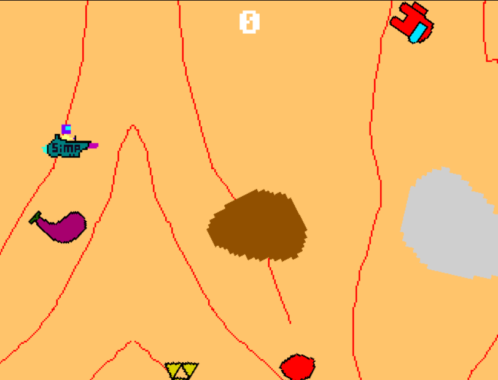

I was simply doing my games, **Aspace** for example, a game where you need to
avoid the trash destroying them.

If someone asks me how Kaboom felt, I would send them this video:

<iframe width="560" height="315" src="https://www.youtube.com/embed/xF3--Ec_E-0?si=7z431BYHNgt6rcUg" title="YouTube video player" frameborder="0" allow="accelerometer; autoplay; clipboard-write; encrypted-media; gyroscope; picture-in-picture; web-share" referrerpolicy="strict-origin-when-cross-origin" allowfullscreen></iframe>

By the way, I learned how to play this song in Ukelele.
[Here's the tabs](https://gist.github.com/lajbel/8c7d667b3d36c689087c9272f6bc87a3).

## Me and Kaboom

Using the library I found some suck points, my first issue was about the text
wrapping.

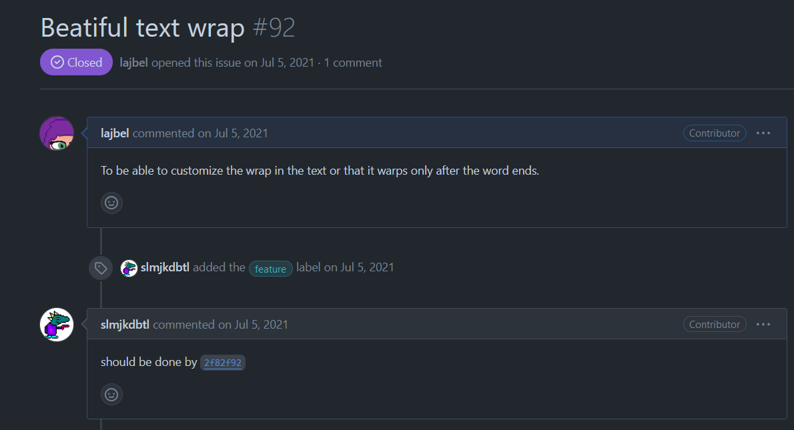

And my feature request was approved and added to the library. Was epic, it was
probably one of my first issues in a open source project.

Then I found more bugs, and I opened more issues.

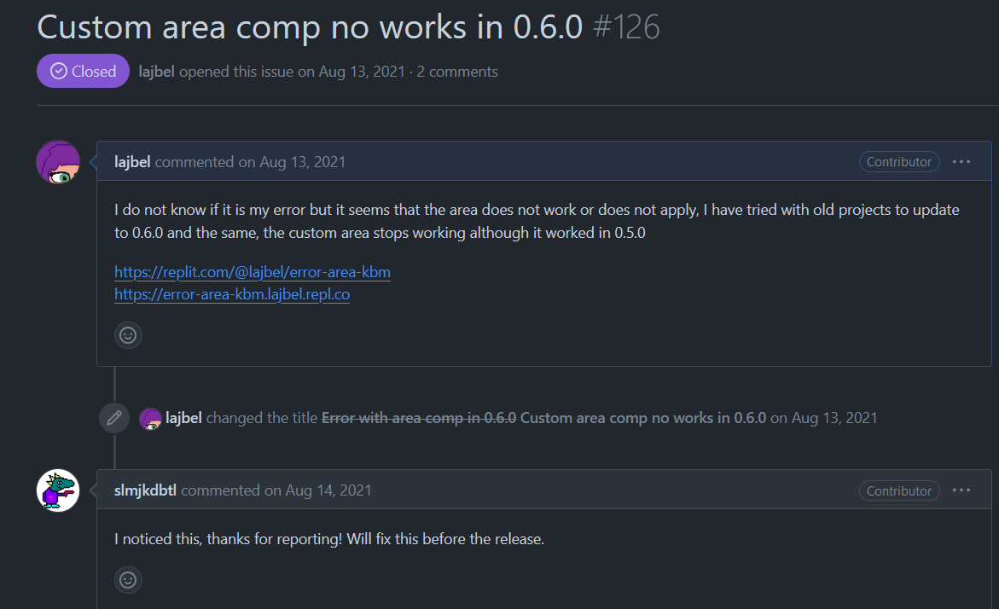

In that time, I was probably the only one using the master branch in my
projects, and I found a lot of bugs in the library, is probably the most bugged
thing that I never used in my life, but I loved it.

Simply to use, I was being so productive, I was making games in a week, in a
month, and yes they were simple games, but I was learning a lot, having fun and
doing something that from child was my dream, make games.

Then I started experimenting with plugins in the library, there's one of the
first plugins that I made:

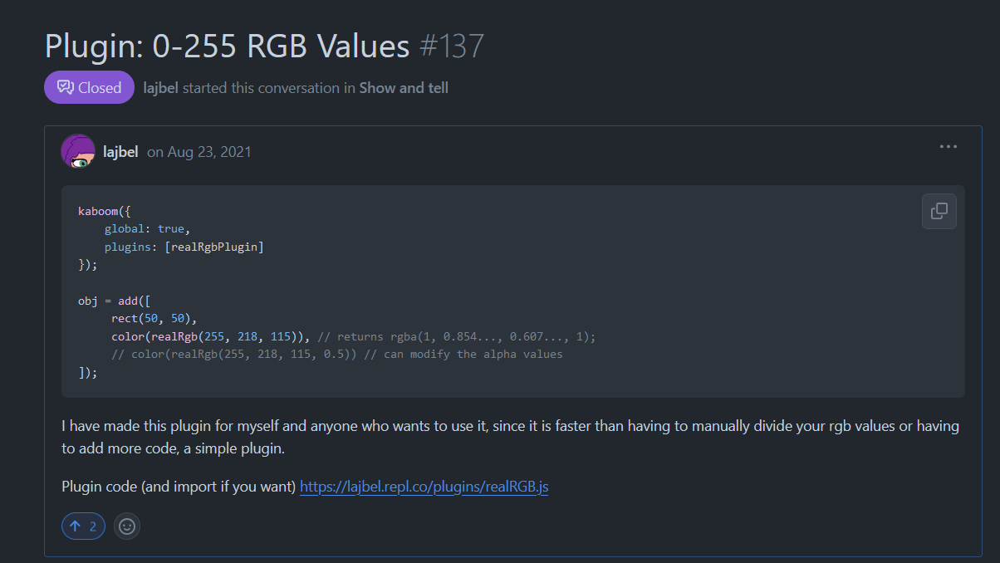

Yes! `rgb()` only accepted values from 0 to 1, and I wanted to use the values
from 0 to 255, so I made a plugin to do that, because I thonk about tga doing
much work, and personally I don't wanted to wait for him to do that.

Some time later, I opened many issues, `#132`, `#138`, `#112`, and my first PR,
adding an example dthe [egg](https://kaboomjs.com/play?example=egg) example.
(Yes, like the peppa pig game)

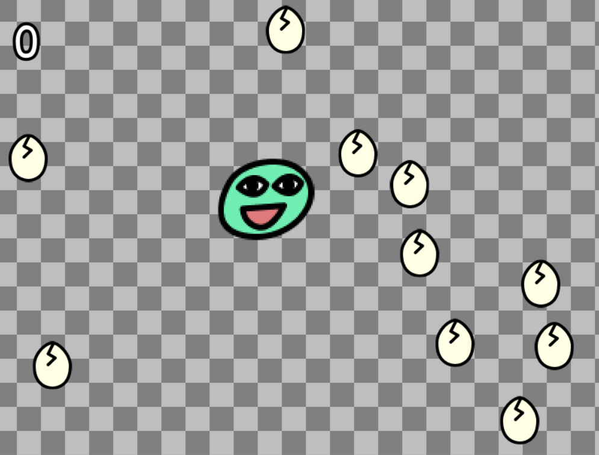

## Being a community manager

Kaboom was growing, and I was growing with it. After time I got involved with
tga, and I "founded" the Kaboom Community in a Discord Server, I was a moderator
there, and I was always helping the new members. Even some of the contributors
of the new fork was introduced to Kaboom by me.

In that time the community was like 30 persons, tga released Kaboom 2000.0.0

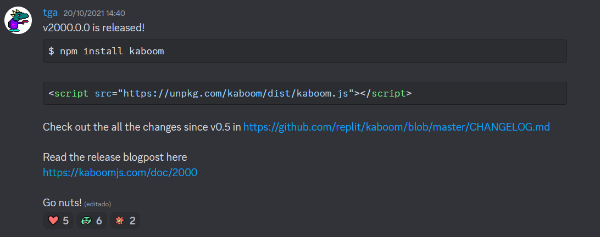

The community grew up a lot, we reached 100 members in the Discord Server.

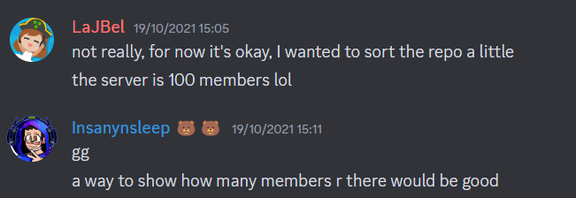

That way was one of my other projects, **MarkBot**, a Discord Bot for the Kaboom
Server.

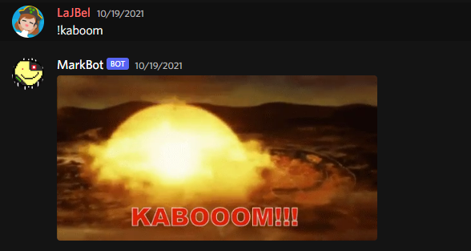

From being a moderator, I organized game jams. It was the Mark Jam, created in
response to the community's desire for more jams, even after Replit held their
"KAJAM." I took the initiative and made it happen.
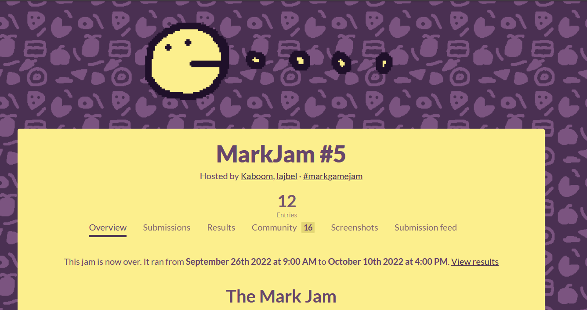

Yes, there was a #1, #2, #3 and #4, but the MarkJam #5 was the one with most
participants, 12 games! It was a great jam, and I was very happy with the
results of it.

I was selected as a Replit Rep to do community events, and I did a lot of
workshops about Kaboom, even a livestream teaching the basics of Kaboom in
Spanish. It was my first livestream, and I was very nervous. It is still online,
it embarrasses me a lot, but I'm proud of it.

Then I also worked in Replit as an intern, to do the 3000 version. I was very
happy to contribute to tga's project, and I was very happy to see the community
grow.

With the time, I realized that tga was a kind of mentor for me. Much of the
things that I do in code, even today, I learned from him. I'm very grateful for
that. From here, I want to say thank you, tga.

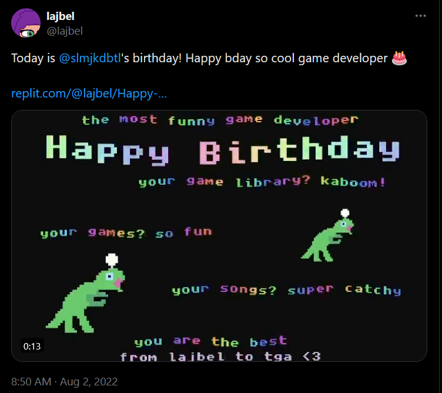

## The art

I'm not a good artist, but I tried to make some art for my games, and I made
also the art of Kaboom v3000, in special the logo.

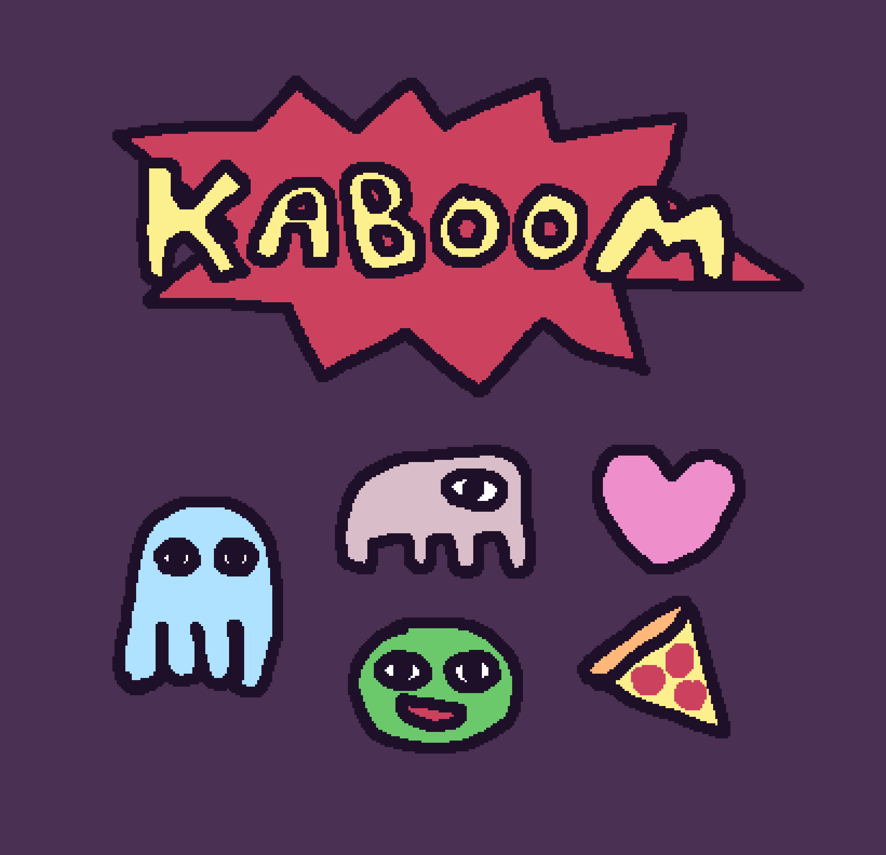

Yes I know, it's not a good art, but I tried my best. After that I did the logo
that you see in the Kaboom website.

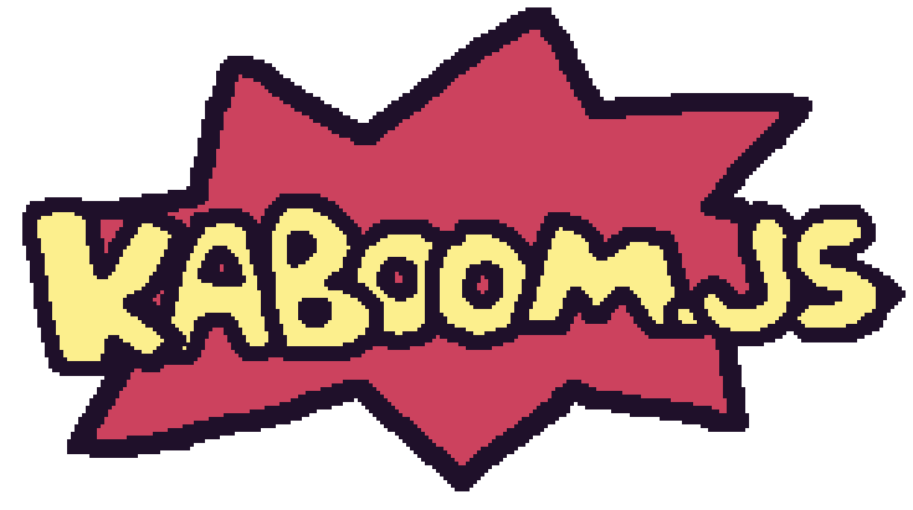

I also made some of the art sprites, like my famous egg, now that old example
looks like this:

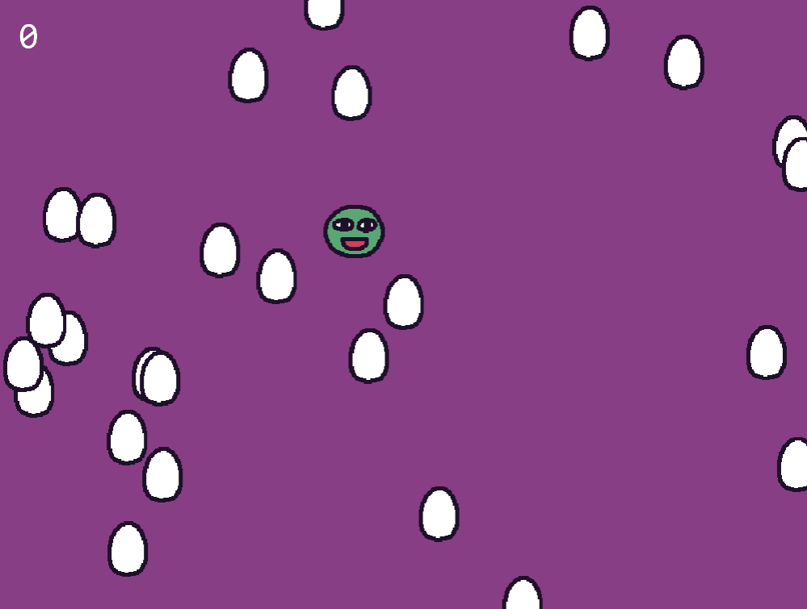

## A new journey

With Kaboom, I knew a lot of people, I learned a lot of things, I made a lot of
games, and I had a lot of fun. But all good things come to an end, and Kaboom
was no different.

One day, I known that Replit stopped the Kaboom.js development. I was sad, but I
understood. Now is my turn.

When I was a child, I loved to read books about Dinosaurs, I was fascinated by
them, the Argentinosaurus, the T-Rex, the Triceratops, all of them, and I had
many books about them.

Actually, I don't read much about them anymore, but now I code and develop
games, probably a worse destiny than extinction, but I like it.

Then, I started a new fork of Kaboom, KAPLAY. Now it has more than 100 stars on
GitHub and many new features.

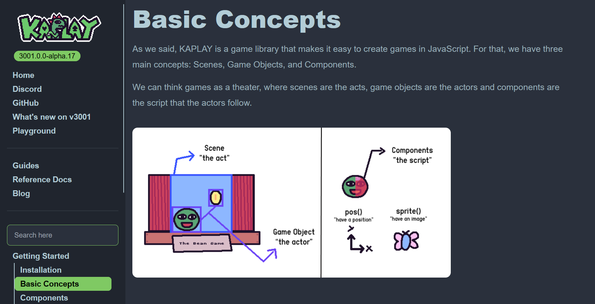

I'm very happy with the results of it, and I'm very happy with the community
that we are building around it. Sometimes I wrote Kaboom instead of KAPLAY and
that makes me sad sometimes.

But now I have to work hard in KAPLAY, so it can grow and follow what Kaboom was
for me, a fun and easy library to make games.

I hope you like KAPLAY.

Thank you, "lajbel".
